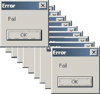

<h1> Hello World!  </h1>

 Hi! My name is Shuhan Yang. Thank You for taking the time to view my GitHub Profile :smile: 

<h2> About Me </h2>

- 🔭 I’m currently working on decoding spatial information integration mechanism regarding the Medial Septum in rats.

- 🌱 I’m currently learning Computational Neuroscience, System Neuroscience, Signal Processing, Neuropixels Implementation... 

- 👯 I’m open to collaborate on Neuroscience projects, articles... 

- 💬 Talk to me about Neuroscience,Python, Matlab, Bouldering, Surfing, Art... 

<h2> Skills  </h2>

<h2> Connect with me  </h2>
 
 

<h2> My GitHub Stats  </h2>

  

 
<footer align='center'>README made with help of <a href='https://github.com/rahulbanerjee26/githubProfileReadmeGenerator'>githubProfileReadmeGenerator</a> </footer>
